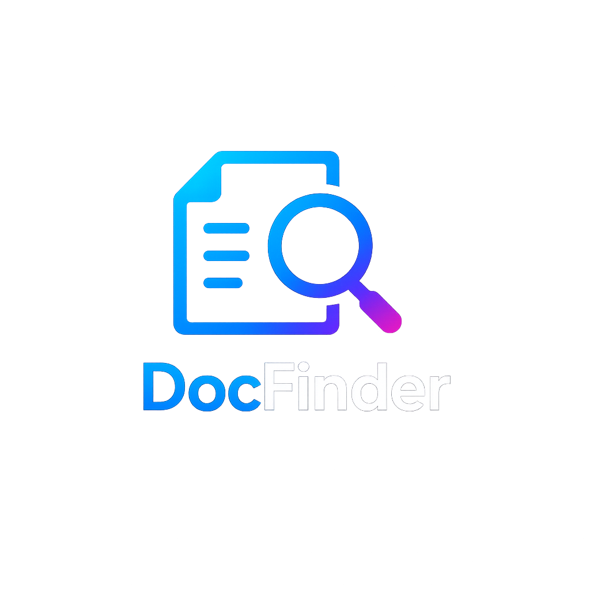
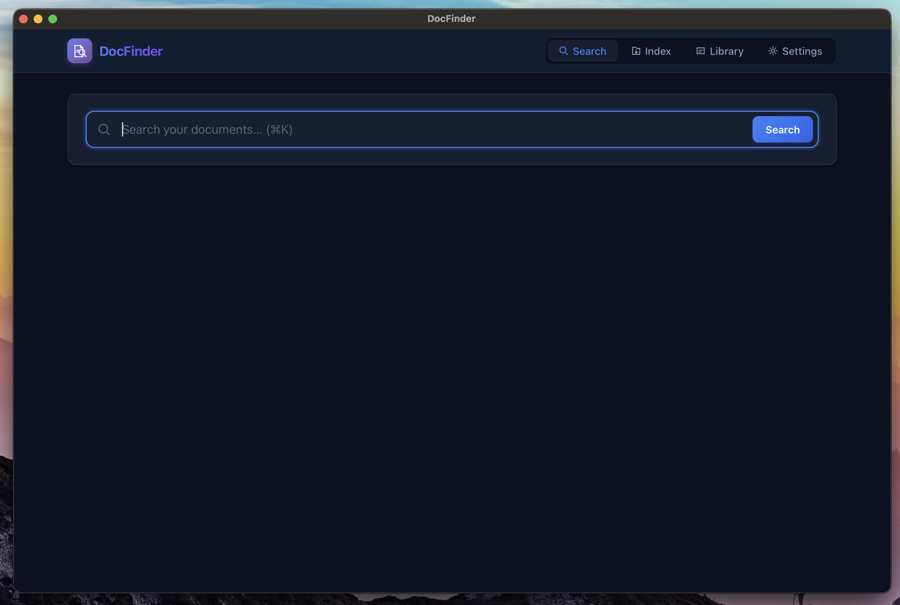
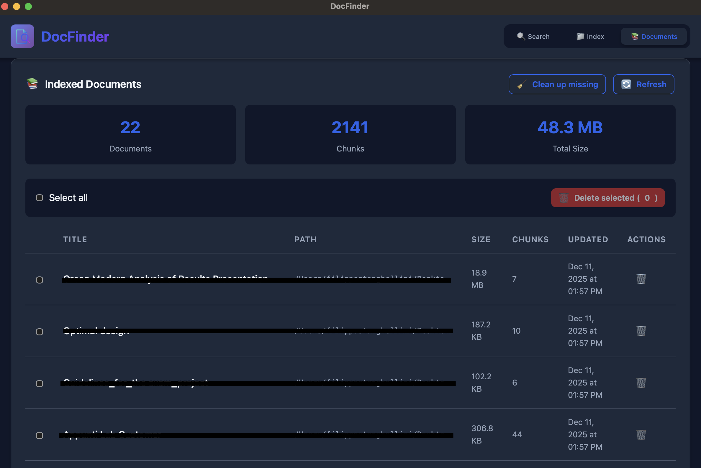

# DocFinder

[](https://github.com/filippostanghellini/DocFinder/actions/workflows/ci.yml)
[](https://github.com/filippostanghellini/DocFinder/actions/workflows/codeql.yml)
[](LICENSE)
[](https://www.python.org/downloads/)
[](https://github.com/astral-sh/ruff)
[](https://github.com/filippostanghellini/DocFinder/stargazers)
[](https://github.com/filippostanghellini/DocFinder/releases)
[](https://github.com/filippostanghellini/DocFinder/releases)

<p align="center">
  
</p>

<p align="center">
  <strong>🔍 Local-first semantic search for your PDF documents</strong>
</p>

<p align="center">
  Index and search your PDFs using AI powered semantic embeddings.<br>
  Everything runs locally on your machine no cloud, no external services, complete privacy.
</p>

---

## ✨ Features

- **100% Local**: Your documents never leave your machine
- **Fast Semantic Search**: Find documents by meaning, not just keywords
- **Cross-Platform**: Native apps for macOS, Windows, and Linux
- **GPU Accelerated**: Auto-detects Apple Silicon, NVIDIA, or AMD GPUs
- **PDF Optimized**: Powered by PyMuPDF for reliable text extraction
- **Web Interface**: UI for indexing and searching

---

## 🚀 Quick Start

### 1. Install

Download the app for your platform from [**GitHub Releases**](https://github.com/filippostanghellini/DocFinder/releases):

| Platform | Download | 
|----------|----------|
| **macOS** | [DocFinder-macOS.dmg](https://github.com/filippostanghellini/DocFinder/releases/latest) |
| **Windows** | [DocFinder-Windows-Setup.exe](https://github.com/filippostanghellini/DocFinder/releases/latest) |
| **Linux** | [DocFinder-Linux-x86_64.AppImage](https://github.com/filippostanghellini/DocFinder/releases/latest) |

### 2. Index Your Documents

1. Open DocFinder
2. Enter the path to your PDF folder (e.g., `~/Documents/Papers`)
3. Click **Index** and wait for completion

### 3. Search

Type a natural language query like:
- *"contract about property sale"*
- *"machine learning introduction"*
- *"invoice from December 2024"*

DocFinder finds relevant documents by **meaning**, not just exact keywords.

---

## 📸 Screenshots

<details>
<summary>Click to expand</summary>

**Search**


**Index Documents**


**Database**


</details>

---

## 💻 System Requirements

| Component | Minimum | Recommended |
|-----------|---------|-------------|
| **RAM** | 4 GB | 8 GB+ |
| **Disk Space** | 500 MB | 1 GB+ |
| **macOS** | 11.0 (Big Sur) | 13.0+ (Ventura) |
| **Windows** | 10 | 11 |
| **Linux** | Ubuntu 20.04+ | Ubuntu 22.04+ |

### GPU Support (Optional)

DocFinder **automatically detects** your hardware and uses the best available option:

| Hardware | Support | Notes |
|----------|---------|-------|
| **Apple Silicon** (M1/M2/M3/M4) | ✅ Automatic | Uses Metal Performance Shaders |
| **NVIDIA GPU** | ✅ With `[gpu]` extra | Requires CUDA drivers |
| **AMD GPU** | ✅ Automatic | Uses ROCm on Linux |
| **CPU** | ✅ Always works | Fallback option |

---

## 📦 Installation

### Desktop App (Recommended)

#### macOS

1. Download `DocFinder-macOS.dmg`
2. Open the DMG and drag **DocFinder** to **Applications**
3. **First launch**: Right-click → **Open** → Click **Open** again

> ⚠️ macOS shows a warning because the app isn't signed with an Apple Developer ID. This is normal for open-source software.

#### Windows

1. Download `DocFinder-Windows-Setup.exe`
2. Run the installer
3. If SmartScreen warns you: Click **More info** → **Run anyway**

#### Linux

```bash
wget https://github.com/filippostanghellini/DocFinder/releases/latest/download/DocFinder-Linux-x86_64.AppImage
chmod +x DocFinder-Linux-x86_64.AppImage
./DocFinder-Linux-x86_64.AppImage
```

---

### Python Package

For developers or advanced users:

```bash
# Create virtual environment
python -m venv .venv
source .venv/bin/activate  # On Windows: .venv\Scripts\activate

# Install DocFinder
pip install .

# With GPU support (NVIDIA)
pip install '.[gpu]'

# With all extras (development + web + GUI)
pip install '.[dev,web,gui]'
```

---

## 🔧 Usage

### Desktop App

Just launch **DocFinder** from your Applications folder, Start Menu, or run the AppImage.

### Command Line

```bash
# Index a folder of PDFs
docfinder index ~/Documents/PDFs

# Search your documents
docfinder search "quarterly financial report"

# Launch web interface
docfinder web

# Launch desktop GUI (from source)
docfinder-gui
```

### Where is my data stored?

| Mode | Database Location |
|------|-------------------|
| Desktop App | `~/Documents/DocFinder/docfinder.db` |
| Development | `data/docfinder.db` |

---

## 🛠️ Build from Source

```bash
# Clone the repository
git clone https://github.com/filippostanghellini/DocFinder.git
cd DocFinder

# Install dependencies
make install-gui

# Run the GUI
docfinder-gui

# Build native app (macOS)
make build-macos
```

---

## 📁 Project Structure

```
src/docfinder/
├── ingestion/    # PDF parsing and text chunking
├── embedding/    # AI model wrappers (sentence-transformers, ONNX)
├── index/        # SQLite vector storage and search
├── utils/        # File handling and text utilities
└── web/          # FastAPI web interface
```

---

## 🤝 Contributing

Contributions are welcome! Please feel free to submit a Pull Request.

---

## 📄 License

This project is licensed under the **GNU Affero General Public License v3.0 (AGPL-3.0)**.

> **Note**: DocFinder was originally released under the MIT License. Starting from version 0.2.0, the license was changed to AGPL-3.0 to comply with [PyMuPDF](https://pymupdf.readthedocs.io/) licensing requirements.
