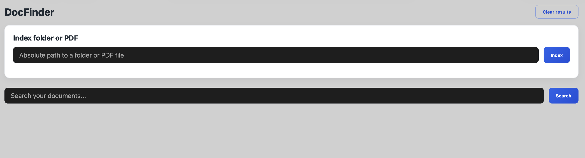

# DocFinder

[](https://github.com/filippostanghellini/DocFinder/actions/workflows/ci.yml)
[](https://github.com/filippostanghellini/DocFinder/actions/workflows/codeql.yml)
[](LICENSE)
[](https://www.python.org/downloads/)
[](https://github.com/astral-sh/ruff)
[](https://github.com/filippostanghellini/DocFinder/stargazers)


DocFinder is a local-first CLI for indexing and searching PDF documents using semantic embeddings stored in SQLite. Everything runs on your machine—no external services required.

## Features
- Extracts text from PDFs with configurable chunking powered by `pypdf`.
- Generates local embeddings via `sentence-transformers` and `onnxruntime`.
- Performs top-k semantic search backed by SQLite BLOB storage and cosine similarity.
- Ships with an optional FastAPI web interface that lets you trigger indexing and open PDFs with one click.
- **Auto-detects hardware** (Apple Silicon, NVIDIA GPU, AMD GPU, CPU) and optimizes performance automatically.

## Requirements
- Python 3.10 or newer.
- macOS, Linux, or Windows (tested on Apple Silicon).
- No native SQLite extensions needed—vector data is stored as plain BLOBs.

## Installation

```bash
python -m venv .venv
source .venv/bin/activate
pip install --upgrade pip
pip install .
```

For **NVIDIA GPU acceleration** (Linux/Windows):

```bash
pip install '.[gpu]'
```

Development extras:

```bash
pip install '.[dev]'
```

Web interface extras:

```bash
pip install '.[web]'
```

All extras combined:

```bash
pip install '.[dev,web,gpu]'
```

> **Note**: DocFinder automatically detects your hardware (Apple Silicon, NVIDIA GPU, AMD GPU, or CPU) and uses the optimal backend. GPU support on NVIDIA requires the `gpu` extra above.

## Usage

### Index a folder

```bash
docfinder index ~/Documents --db data/docfinder.db
```

### Run a semantic search

```bash
docfinder search "contract of sale" --db data/docfinder.db --top-k 10
```

### Launch the web interface

```bash
docfinder web --db data/docfinder.db --host 127.0.0.1 --port 8000
```

Open `http://127.0.0.1:8000` in your browser to search and open PDFs.



To index through the UI:

1. Start the server with the command above.
2. Enter the absolute path of the folder (or single PDF) in the **Index** panel.
3. Click **Index** and wait for the completion summary.

Search results list the file path, similarity score, and an excerpt from the matching chunk.

## Project structure
- `src/docfinder/ingestion`: PDF parsing and chunking.
- `src/docfinder/embedding`: embedding model wrappers.
- `src/docfinder/index`: SQLite vector storage and search.
- `src/docfinder/utils`: hashing, chunking, and file helpers.
- `tests`: automated checks.

## Roadmap
- Add a real-time watcher based on `watchdog`.
- Enrich documents with custom metadata.
