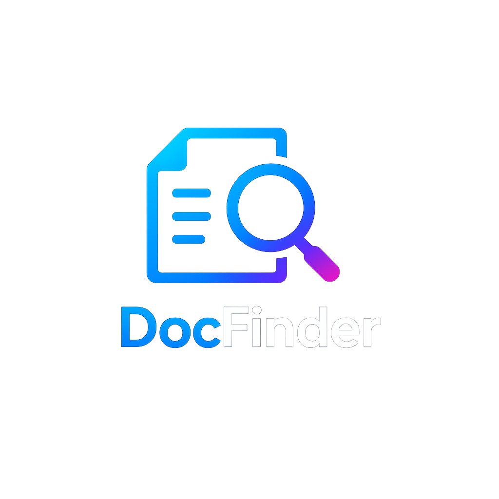
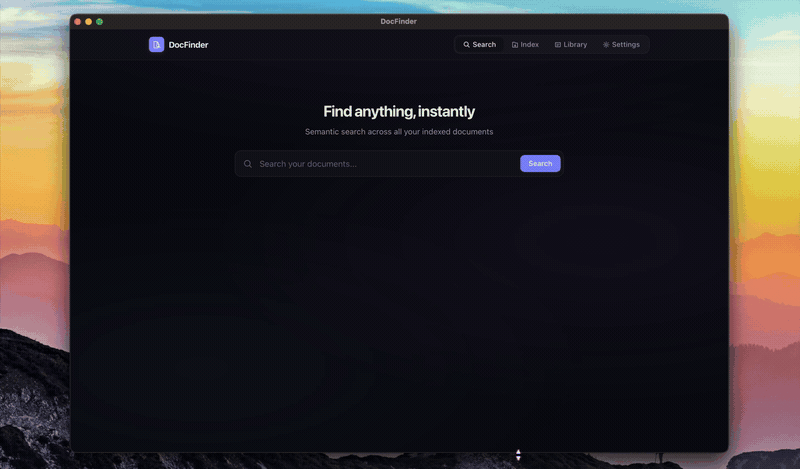

# DocFinder

[](https://github.com/filippostanghellini/DocFinder/actions/workflows/ci.yml)
[](https://github.com/filippostanghellini/DocFinder/actions/workflows/codeql.yml)
[](LICENSE)
[](https://www.python.org/downloads/)
[](https://github.com/filippostanghellini/DocFinder/releases)
[](https://github.com/filippostanghellini/DocFinder/releases)

<p align="center">
  
</p>

<p align="center">
  <strong>Local-first semantic search for your documents.</strong><br>
  Supports PDF, Word (.docx), Markdown, and plain text files.<br>
  Everything runs on your machine — no cloud, no accounts, complete privacy.
</p>

<p align="center">
  
</p>                                                                        

## Features

- **Semantic search** — find documents by meaning, not just keywords (PDF, DOCX, Markdown, TXT)
- **100% local** — your files never leave your machine
- **GPU accelerated** — auto-detects Apple Silicon (Metal), NVIDIA (CUDA), AMD (ROCm)
- **Cross-platform** — native apps for macOS, Windows, and Linux
- **Global shortcut** — bring DocFinder to front from anywhere with a configurable hotkey

## Download

| Platform | Installer |
|----------|-----------|
| **macOS** | [DocFinder-macOS.dmg](https://github.com/filippostanghellini/DocFinder/releases/latest) |
| **Windows** | [DocFinder-Windows-Setup.exe](https://github.com/filippostanghellini/DocFinder/releases/latest) |
| **Linux** | [DocFinder-Linux-x86_64.AppImage](https://github.com/filippostanghellini/DocFinder/releases/latest) |

**macOS** — open the DMG, drag DocFinder to Applications, then right-click → **Open** on first launch (Gatekeeper warning — normal for unsigned open-source apps).

**Windows** — run the installer; if SmartScreen appears choose **More info → Run anyway**.

**Linux**
```bash
chmod +x DocFinder-Linux-x86_64.AppImage && ./DocFinder-Linux-x86_64.AppImage
```

## Run from Source

Requires Python 3.10+ and `make`.

```bash
git clone https://github.com/filippostanghellini/DocFinder.git
cd DocFinder
make setup   # create .venv and install all dependencies
make run     # desktop GUI
make run-web # web interface at http://127.0.0.1:8000
```

## Contributing

Contributions are welcome, feel free to open an issue or submit a pull request.

## License

Licensed under the **GNU Affero General Public License v3.0 (AGPL-3.0)**.

> DocFinder was originally released under the MIT License. Starting from version 1.1.1 the license was changed to AGPL-3.0 to comply with the [PyMuPDF](https://pymupdf.readthedocs.io/) licensing requirements, as PyMuPDF itself is AGPL-3.0 licensed.
