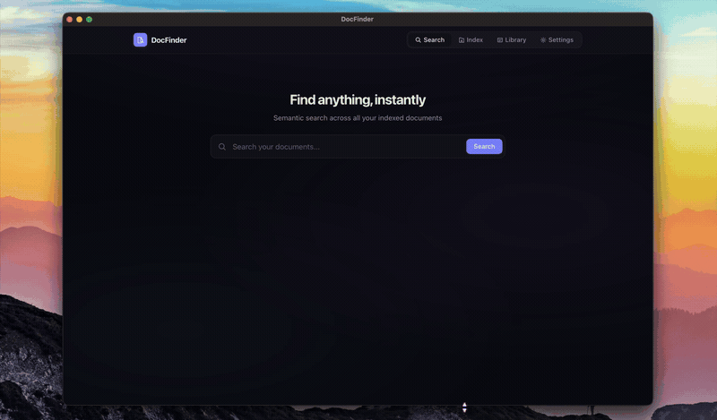
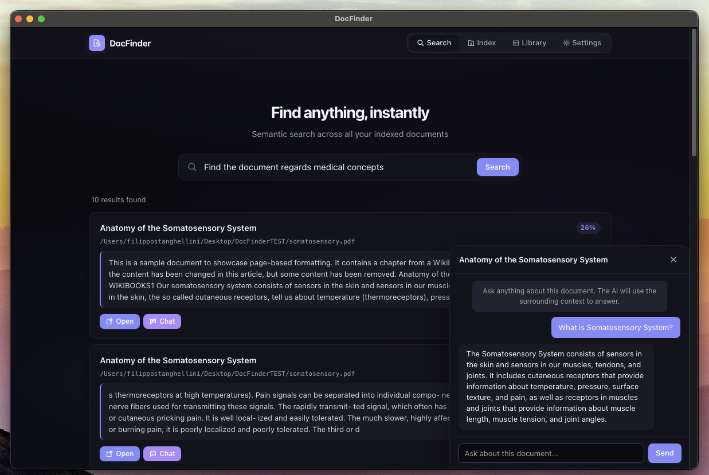

<div class="hero" markdown>

# DocFinder

**Local-first semantic search for your documents.**

Find by meaning across PDF, Word, OpenDocument, PowerPoint, HTML, EPUB,
Markdown and plain text — everything runs on your machine. No cloud,
no accounts, complete privacy.

[:material-download: Download](https://github.com/filippostanghellini/DocFinder/releases/latest){ .md-button .md-button--primary }
[:fontawesome-brands-github: GitHub](https://github.com/filippostanghellini/DocFinder){ .md-button }

</div>

{ .hero-shot }

<div class="grid cards" markdown>

- :material-text-search: __Semantic search__ — find documents by meaning, not just keywords
- :material-chat-outline: __Local AI chat__ — precise answers from your documents, powered by Qwen3.5 models running offline
- :material-file-document-multiple: __More formats__ — PDF, DOCX, PPTX, ODT, HTML, EPUB + others
- :material-memory: __GPU accelerated__ — auto-detects Apple Silicon (Metal), NVIDIA (CUDA), AMD (ROCm)
- :material-shield-lock: __100% private__ — your files never leave your machine
- :material-keyboard: __Global hotkey__ — bring DocFinder to front from anywhere

</div>

## Quick Start

### Download

| Platform | Installer |
|----------|-----------|
| **macOS** | [DocFinder-macOS.dmg](https://github.com/filippostanghellini/DocFinder/releases/latest) |
| **Windows** | [DocFinder-Windows-Setup.exe](https://github.com/filippostanghellini/DocFinder/releases/latest) |
| **Linux** | [DocFinder-Linux-x86_64.AppImage](https://github.com/filippostanghellini/DocFinder/releases/latest) |

### Run from Source

```bash
git clone https://github.com/filippostanghellini/DocFinder.git
cd DocFinder
make setup     # install all dependencies
make run       # desktop GUI
make run-web   # web interface at http://127.0.0.1:8000
```

See the [Installation](install.md) page for detailed instructions.

---

<p align="center">
  
</p>
