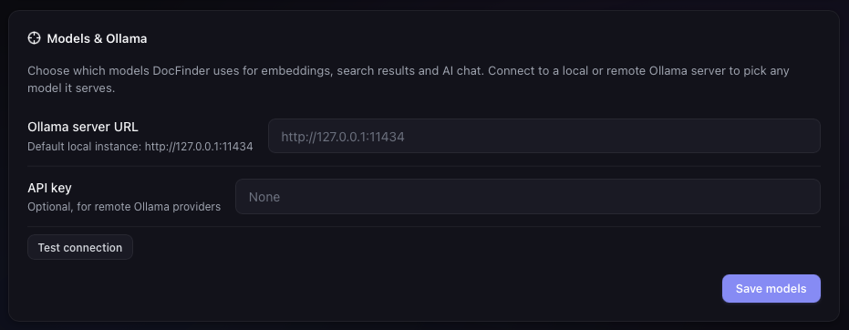
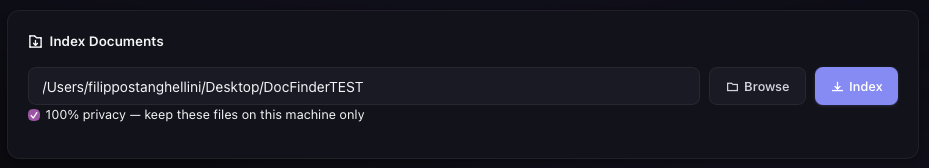

# Usage

DocFinder provides a **desktop GUI** and a **web interface**.

## Desktop GUI

Launch the native desktop application:

```bash
make run
```

The GUI provides:

- Document browser and indexer
- Semantic search bar with relevance results
- AI chat panel for asking questions about your documents
- Global shortcut hotkey support

### Indexing Documents

Open the application and use the built-in file browser to select documents or folders. DocFinder will automatically discover all supported files and index them.

### Searching

Type your query in the search bar. Results are ranked by semantic relevance and displayed with page numbers and document titles.

### Global Hotkey

The global shortcut (configurable in Settings) lets you bring DocFinder to the front from anywhere. The default hotkey is `<alt>+d` on all platforms.

### Models & Ollama (Settings)

The **Models & Ollama** card in Settings lets you replace the built-in models with ones served by
an Ollama server:

1. Enter the **Ollama server URL** (e.g. `http://127.0.0.1:11434`) and, for remote providers, an
   optional **API key**
2. Click **Test connection** — a badge shows whether the server is reachable and how many models
   are installed
3. Pick the **embedding model** and the **chat model** from the lists of installed models
4. Click **Save models**

Changing the embedding model invalidates the existing index: a warning banner appears with a
**Re-index now** button that clears and re-indexes the previously indexed folders automatically.
Changing the chat model applies immediately. The server can be local or remote (VPS/Ollama
provider).



### 100% Privacy Mode

The Index tab has a **100% privacy** checkbox. When checked, the indexed files are marked in the
database with a privacy flag: indexing requires a local embedding model, and AI chat on those
documents refuses remote LLMs (Ollama on `localhost` is allowed — data never leaves your
machine). Privacy-marked documents show a shield badge in the Documents tab, and re-indexing
preserves the flag.



## Web Interface

Launch the web interface:

```bash
make run-web
```

Open [http://127.0.0.1:8000](http://127.0.0.1:8000) in your browser.

The web UI mirrors the desktop GUI features. By default it listens on `127.0.0.1` (local only); start it with `docfinder web --host 0.0.0.0` to access it from other devices on your network.
